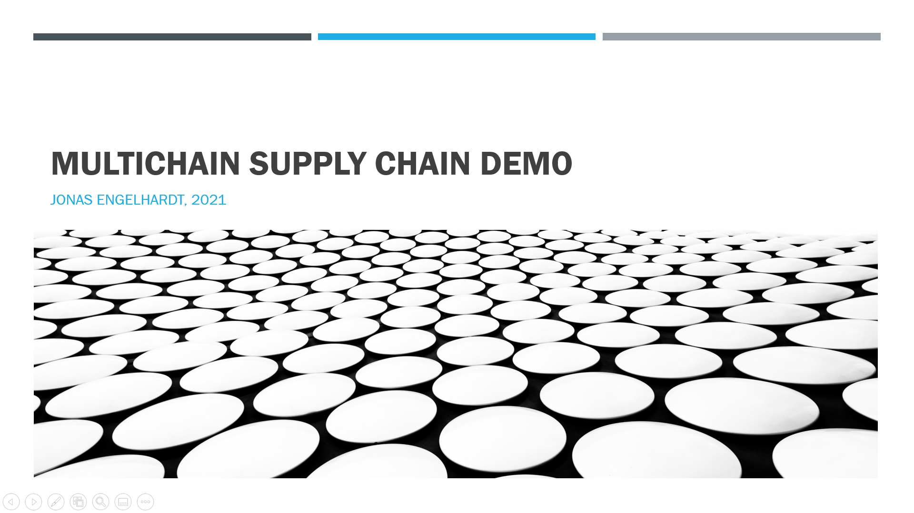
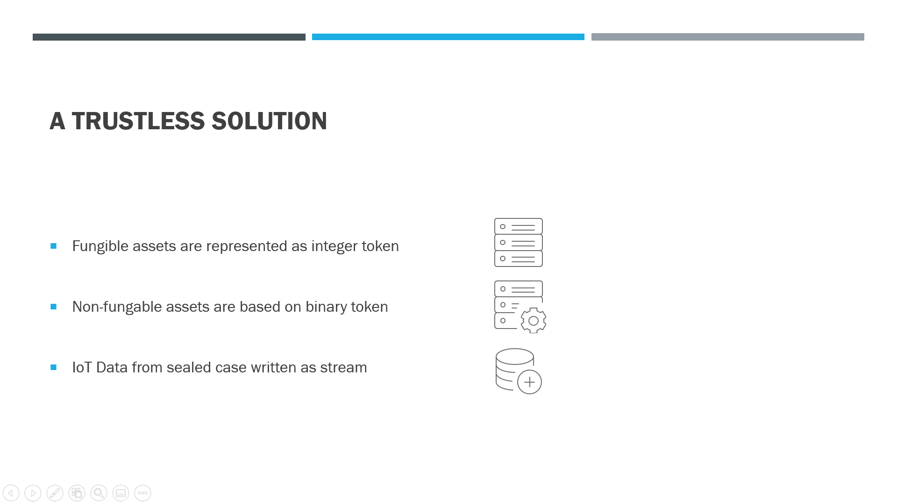
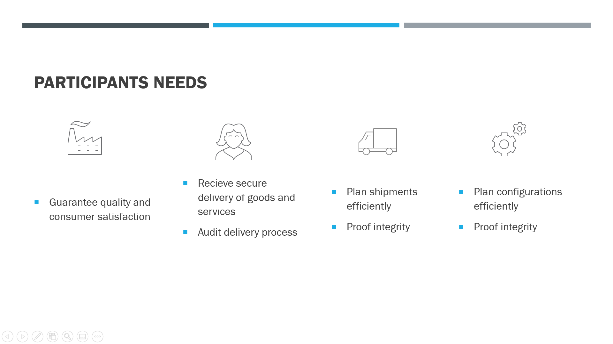

# multichain-supplychain-demo
This project aims to offer a drastically simple blockchain demo of a trustless supply chain, in which a customer buys an electronic device from an OEM after a service provider added value to it. Throughout the entire supply chain an IoT device is monitoring environment parameters and a tail of the syslogs for the OEM and Service Provider to be able to prove correnct treatment and secure delivery.

## Installation
The underlying blockchain can be installed, configured and all participants permissioned using the following Ansible project on [Github](https://github.com/joengelh/multichain-ansible-automation)

Thereafter copy the .env.sample file to .env and fill in your nodes addresses and private keys.

:warning: **Dont share private keys in production**: seperate the .env files to each node according to ownership instead :warning:

In order to install the required python packages run:

```bash
pip3 install -r requirements.txt
```

## Participants
A multitude of web-based apps give every one of the following stakeholders direct access to the blockchain.

name | description | port webinterface | port api | status
-----|-------------|-------------------|----------|-------
serviceProvider | participant adding value to product | 5004 | 5009 |
customer | product purchasing party | 5004 | 5007 |
oem | initial producer of product | 5004 | 5003 |
bank | issuer of stablecoin USD | 5002 | 5001 |
iot | IoT Device with full copy of ledger | - | - |

## Use Case

In this usecase, an OEM is selling goods (electronic devices) to a customer, using a stablecoin USD.
The stablecoin is issued by a bank on **port 5002** and can be refunded by sending the tokens to the networks burn address.

In order to represent the goods on the supplychain, the OEM mints products by issuing a new asset class and selling the asset to the service provider in an atomic exchange for USD.

Afterwards the service provider re-sells the product to the customer for the original price plus a markup using multichains atomic exchange functionality aswell.
From the minting of the asset until the customers reception of the product, the IoT OEM can initiate a virutal IoT device which writes data contiuously to the blockchain regarding location, temperature, humidity, shock (G-force) and the tail of the syslogs.

Before accepting the atomic exchange both the Customer and the Service Provider can check the data written by the IoT device on **port 5004** and thus check for mistreatment or malware deployment in the syslogs.

## Run it!
After the multichain has been deployed using for example this [Github Project](https://github.com/joengelh/multichain-ansible-automation) and the .env file has been filled with the nodes addresses and private keys, the webservers can be started by executing the **run.sh** script.

```bash
bash run.sh
```

## Powerpoint



### The Problem


### A The Solution




