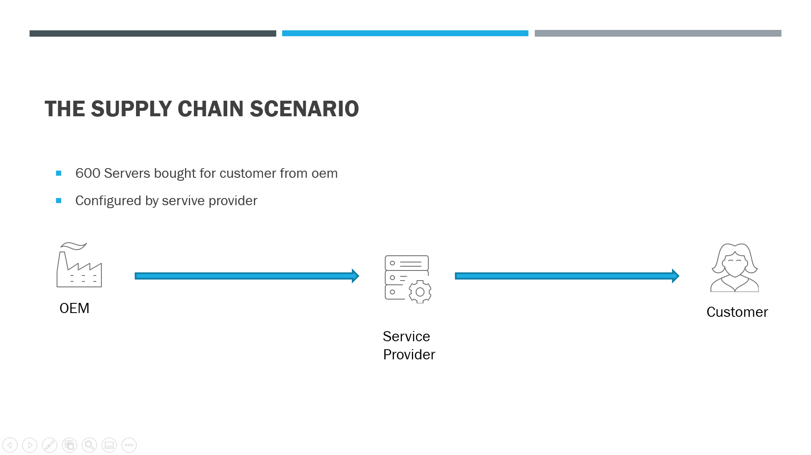
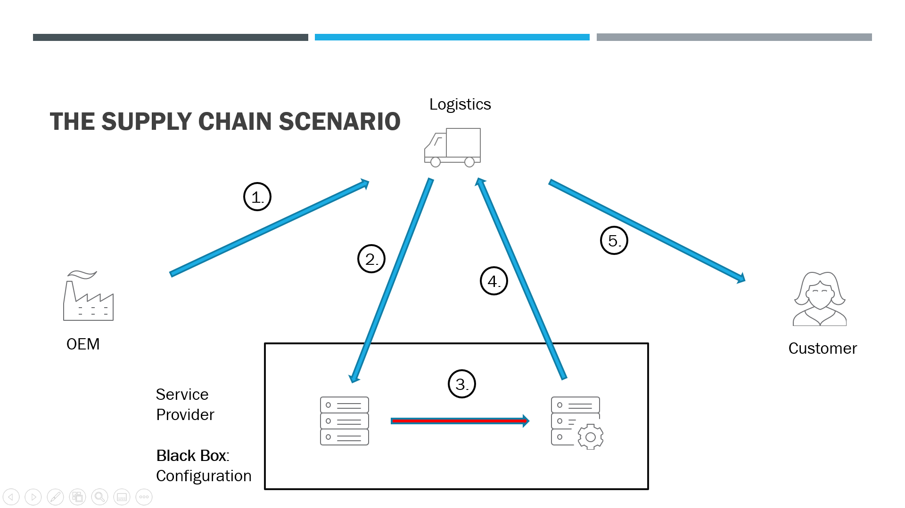
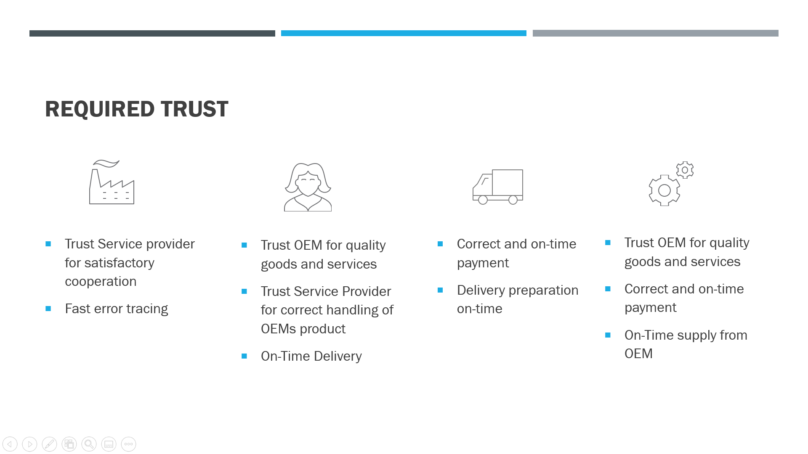

# multichain-supplychain-demo
This project aims to offer a drastically simple blockchain demo of a trustless supply chain.

## Installation
The underlying blockchain can be installed, configured and all participants permissioned using the following Ansible project on [Github](https://github.com/joengelh/multichain-ansible-automation)

## Participants
A multitude of web-based apps give every one of the following stakeholders direct access to the blockchain.
Since this project is still in the making, a ```-``` stands for an endpoint still to be developed.

name | description | port webinterface | port api | status
-----|-------------|-------------------|----------|-------
serviceProvider | participant adding value to product | - | - | :heart:
customer | product purchasing party | - | - | :heart:
iot | device attached to product, monitoring | no frontend required | 5005 | :green_heart:
oem | initial producer of product | - | 5003 | :yellow_heart:
bank | issuer of stablecoin USD | 5002 | 5001 | :green_heart:

## use case

In this usecase, an OEM is selling goods (electronic devices) to a customer, using a stablecoin USD.
The stablecoin is issued by a bank and can be refunded by sending the tokens to the networks burn address.

In order to represent the goods on the supplychain, the OEM mints products by issuing a new asset class and selling the asset to the service provider in exchange for USD.

Afterwards the service provider re-sells the product to the customer for the original price plus a markup using multichains atomic exchanges.
Fron the minting of the asset until the customers reception of the product, the IoT member writes data contiuously to the blockchain regarding location, temperature, humidity, shock (G-force) and the tail of the syslogs.

A multichain smart filter ensures the customer will only buy the product if its has been monitored continously by the IoT device and the data does not present damaging circumstances for the product or malware deployment in the syslogs.


### Starting Point



### Black Box



### The Problem



### The Solution


### transactions
1. bank swaps money if requested in gui after login :thumbsup:
2. customer communicates serviceProvider the business needs :thumbsup:
3. serviceProvider communicates oem the besiness needs :thumbsup:
4. oem issues asset & stream :thumbsup:
5. iot writes to stream :thumbsup:
6. oem offers atomic transaction server against EUR :thumbsup:
7. service provider reviews data, accepts
8. service provider writes to steam
9. iot writes to stream
10. service provider offers atomic transaction, server against EUR
11. customer reviews data, accepts


